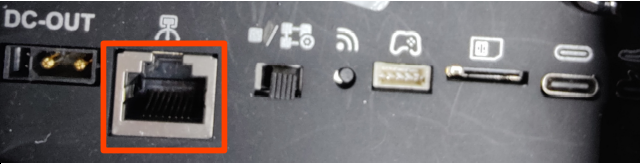
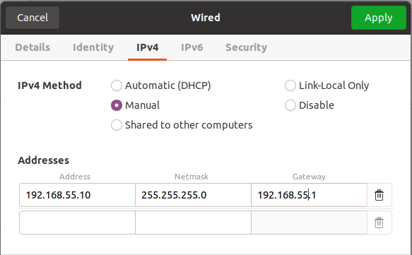

# magicdog_motion_sdk

## 介绍
magicdog motion sdk 提供用户二次开发接口，仅涉及运动控制部分，囊括低层控制器和高层控制器。使用LCM实现远程个人PC和控制板之间的通讯。

[English version](./README.md)

## 依赖
* [LCM](https://github.com/lcm-proj/lcm)

下载lcm，使用cmake编译并安装。

```bash
git clone https://github.com/lcm-proj/lcm.git
cd lcm
mkdir build && cd build
cmake .. 
make
sudo make install
```

lcm 动态库被安装在 `/usr/local/lib` 路径下，若运行提供的[例子](在实机上运行)出现动态库无法找到的错误，在 `~/.bashrc` 文件中添加相应变量
```bash
echo "export LD_LIBRARY_PATH=/usr/local/lib" >> ~/.bashrc
```

## 编译

下载SDK工程，

```bash
git clone https://github.com/MagiclabRobotics/magicdog_motion_sdk.git
cd ${project}  # 进入工程目录 (magiclab_mjr_sdk) 
mkdir build && cd build
cmake ..
make

# 安装 sdk
sudo ../scripts/install.sh
```

## 远程电脑使用SDK

0. 机器人开机，控制板上的运控程序会自启动。

1. 连接数据线，建立个人PC（远程电脑）与控制板的连接。

    

    

2. 配置lcm通讯。
    在个人PC上，

    ```bash
    cd ${project}/scripts
    ./auto_lcminit.sh
    ```

3. 初始化SDK运行环境,
    On your PC,
    
    ```bash
    cd ${project}/scripts
    ./sdk_init t
    ```

4. 确保机器人处于适合起立的状态，在远程电脑上运行提供的示例 （也可以仿照示例实现自己的控制器），
    在个人PC上,
    
    ```bash
    cd ${project}/build
    ./high_level_walk
    ```
    
5. 远程控制器退出时，将检测到lcm数据传输中断，机器人将被设置为 `PureDamper`状态。