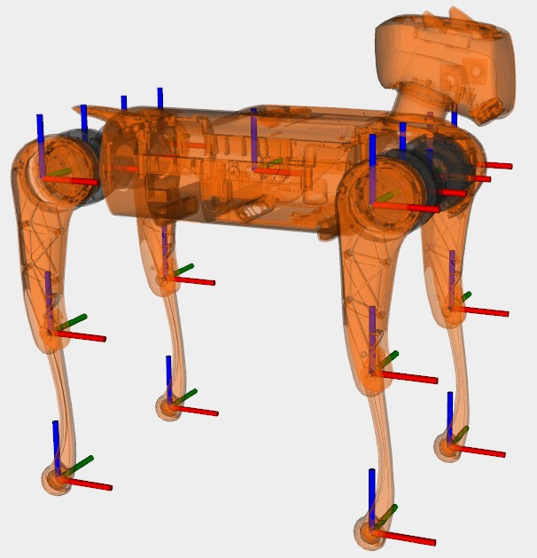

# robot parameters

### Joint coordinate and joint zero position
  

### Leg index
| index | name | meaning |
|:---:|:---:|:---:|
| 0 | FR | front right |
| 1 | FL | front left |
| 2 | RR | rear right |
| 3 | RL | rear left |

### Geometry parameters
| name | value [m] | 
|:---:|:---:|
| Body length  | 0.4135 | 
| Body width   | 0.0100 | 
| Thigh offser | 0.01 | 
| Thigh length | 0.2 | 
| Calf length  | 0.2 |

### Joint range
| name | range min [deg] | range max [deg] | torque max [Nm] | velocity max [rpm]
|:---:|:---:|:---:|:---:|:---:|
| HAA left side | -45 | 37 | 25 | 210 |
| HAA right side | -37 | 45 | 25 | 210 |
| HFE | -72.5 | 207.5 | 25 | 210 |
| KFE | -143 | -30 | 37.5 | 140 |