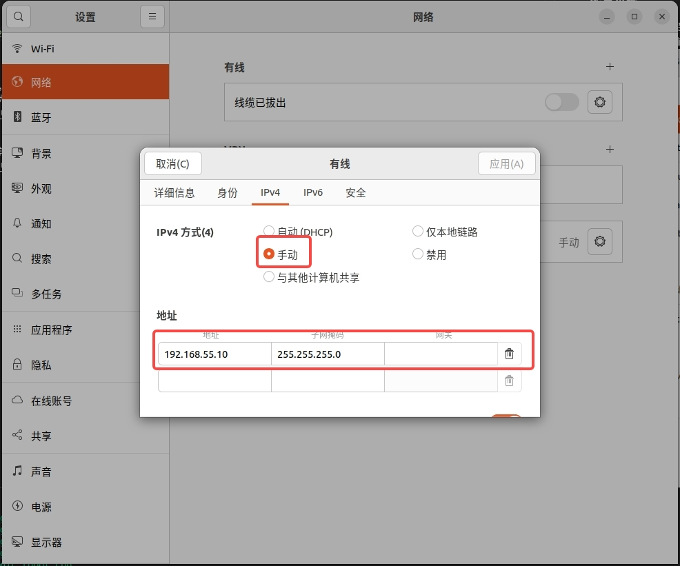
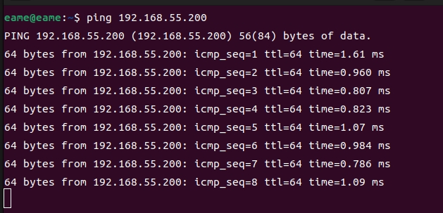
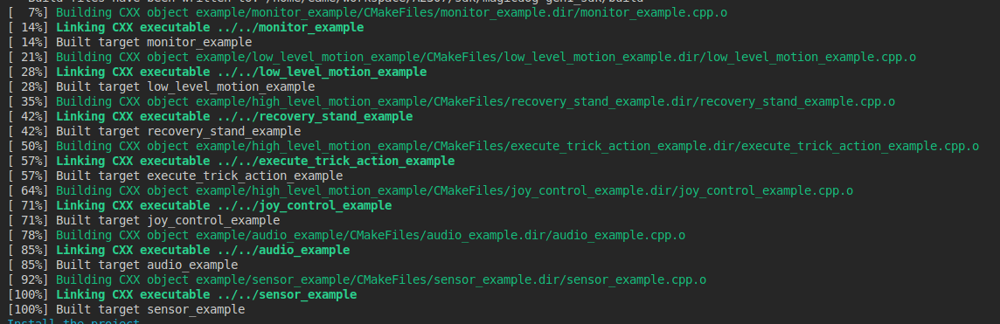

# 快速开始

## 系统环境
推荐在 Ubuntu 22.04 系统下开发，暂不支持 Mac/Windows 系统下开发。机器人本体 PC 运行官方服务，不支持开发环境。

### 开发环境要求
- GCC ≥ 11.4 (for Linux)
- CMake ≥ 3.16
- Make build system
- C++20 (minimum)
- Eigen3
- python3.10

### 第三方库依赖
```
sudo apt update
sudo apt install libgrpc++-dev libgrpc-dev liblcm-dev libyaml-cpp-dev libsystemd-dev -y
sudo apt install cmake python3 python3-dev python3-pip libeigen3-dev build-essential -y
```

### 系统配置

首先，为了实现普通用户下通信实时性，需要在`/etc/security/limits.conf`文件中增加如下配置：
```bash
*    -   rtprio   98
```

其次，为了增加每个socket链接的接收缓存，需要在`/etc/sysctl.conf`文件中增加如下配置，`sudo sysctl -p`立即生效或重启生效：
```bash
net.core.rmem_max=20971520  
net.core.rmem_default=20971520  
net.core.wmem_max=20971520  
net.core.wmem_default=20971520  
```

## 网络环境
将用户计算机与机器人交换机接入统一网络。建议新用户使用网线将用户计算机接入机器人交换机，并将与机器人通信的网卡设置在 192.168.55.X 网段下，推荐使用 192.168.55.10。有经验的用户可自行配置网络环境。

假设 SDK 二次开发 PC 与机器人连接的网口为 `eno1`，需要进行如下配置以便 SDK 与机器人的底层通信：

```bash
 sudo route add -net 224.0.0.0 netmask 240.0.0.0 dev eno1
```

### 配置步骤
1. 用网线的一端连接机器人，另一端连接用户电脑。机器人机载电脑的 IP 地址为 192.168.55.200，所以需要将电脑 ip 设置为同一网段，建议 192.168.55.10。



2. 为了测试通信连接是否正常，可以通过 ping 进行测试：


3. 连通后，执行以下命令

```bash
 sudo route add -net 224.0.0.0 netmask 240.0.0.0 dev eno1
```

## 安装与编译

> 以下步骤假设工作目录为`/home/magicbot/workspace`

### 安装 magicdog-sdk

```
cd /home/magicbot/workspace/magicdog_sdk/
mkdir build
cd build
cmake .. -DCMAKE_INSTALL_PREFIX=/opt/magic_robotics/magicdog_sdk
make -j8
sudo make install
```

>上述命令会把 `magicdog_sdk` 安装到 `/opt/magic_robotics/magicdog_sdk` 目录下

### 例程编译
```
cd /home/magicbot/workspace/magicdog_sdk/
mkdir build
cd build
cmake .. -DBUILD_EXAMPLES=ON
make -j8
```

运行上述命令后，若进度进行到 100% 且没有报错，则意味着编译成功。



### 用户模块导入 magicdog-sdk

如果用户需要在自己的模块中引入 `magicdog-sdk`，可以参考 `example/cmake_example/CMakeLists.txt`

## C++ 例程示例

magicdog_sdk/build目录中：

- **语音示例**:
  - audio_example
- **传感器示例**:
  - sensor_example
- **状态监控示例**:
  - monitor_example
- **底层运控示例**:
  - low_level_motion_example
- **高层运控示例**:
  - high_level_motion_example

### 进入调试模式：

按照操作流程，确保机器人进入调试模式

### 运行例程

进入 magicdog_sdk/build 目录，执行如下命令：

```bash
cd /home/magicbot/workspace/magicdog_sdk/build
# 环境配置
sudo route add -net 224.0.0.0 netmask 240.0.0.0 dev eno1
export LD_LIBRARY_PATH=/opt/magic_robotics/magicdog_sdk/lib:$LD_LIBRARY_PATH

# 语音示例
./audio_example

# 传感器示例
./sensor_example

# 状态监控示例
./monitor_example

# 底层运控示例
./low_level_motion_example

# 高层运控示例
./high_level_motion_example
```

## Python 例程示例

magicdog_sdk/example/python目录中：

- **语音示例**:
  - audio_example.py
- **传感器示例**:
  - sensor_example.py
- **状态监控示例**:
  - monitor_example.py
- **底层运控示例**:
  - low_level_motion_example.py
- **高层运控示例**:
  - high_level_motion_example.py

### 进入调试模式：

按照操作流程，确保机器人进入调试模式

### 运行例程

进入magicdog_sdk/example/python目录，执行如下命令：

``` bash
cd /home/magicbot/workspace/magicdog_sdk/example/python/

# 环境配置
sudo route add -net 224.0.0.0 netmask 240.0.0.0 dev eno1
export PYTHONPATH=/opt/magic_robotics/magicdog_sdk/lib:$PYTHONPATH
export LD_LIBRARY_PATH=/opt/magic_robotics/magicdog_sdk/lib:$LD_LIBRARY_PATH

# 语音示例
python3 audio_example.py

# 传感器示例
python3 sensor_example.py

# 状态监控示例
python3 monitor_example.py

# 底层运控示例
python3 low_level_motion_example.py

# 高层运控示例
python3 high_level_motion_example.py
```

> 注意：手动执行 `sudo route add -net 224.0.0.0 netmask 240.0.0.0 dev eno1` 只会生效一次，开机重启或者网线断连之后，需要重新执行