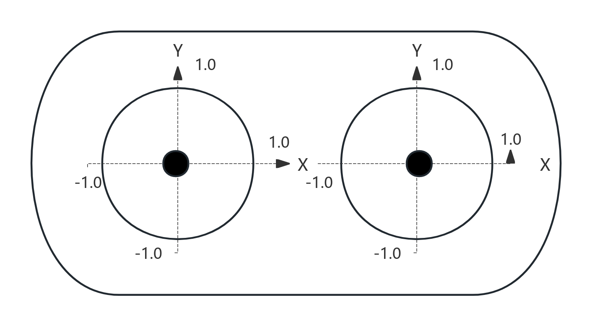
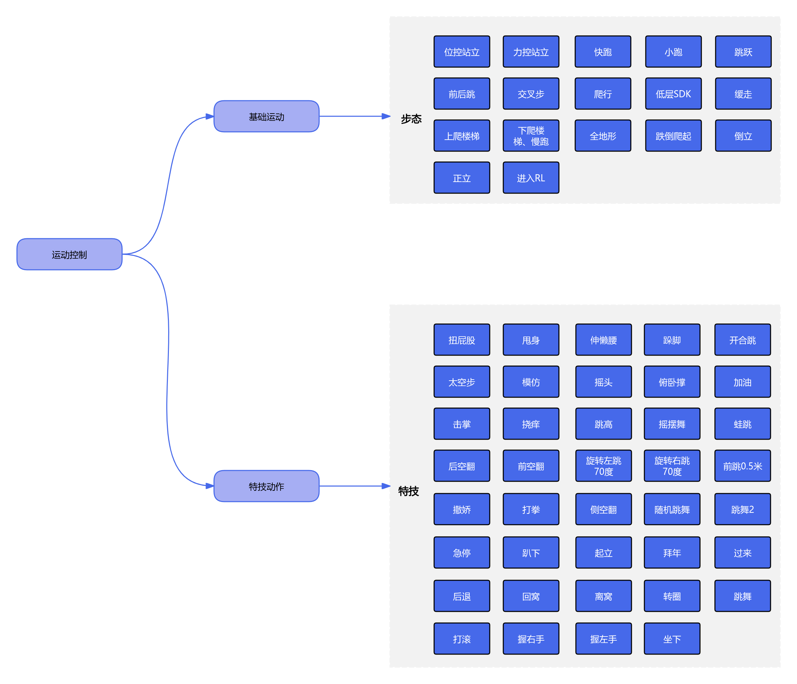

# 高层运动控制服务 (Python)

> 提供机器人系统高层运动控制服务，通过 HighLevelMotionController 可以通过 RPC 通信方式实现对机器人的步态、特技、遥控的控制。

> ⚠️ **注意事项：某些特技动作，比如前空翻、后空翻对场地要求较大，执行时需要额外注意，建议所有特技动作在大的空场地测试后，再在小的场地使用。**

## 接口定义

<code>HighLevelMotionController</code> 是面向语义控制的高层运动控制器，支持如行走、特技等控制操作，封装底层细节以供上层系统调用。

### <code>HighLevelMotionController</code> — 高级运动控制器

<table style="width: 100%; table-layout: fixed; border-collapse: collapse; text-align: left;">
  <thead>
    <tr>
      <th style="width: 40%; text-align: center;"><strong>项目</strong></th>
      <th style="width: 60%; text-align: center;"><strong>内容</strong></th>
    </tr>
  </thead>
  <tbody>
    <tr><td>类名</td><td><code>HighLevelMotionController</code></td></tr>
    <tr><td>功能概述</td><td>面向语义控制的高层运动控制器，支持行走、特技等控制操作</td></tr>
    <tr><td>主要功能</td><td>步态控制、特技执行、摇杆命令发送</td></tr>
    <tr><td>使用场景</td><td>机器人高层运动控制、特技表演、遥控操作</td></tr>
  </tbody>
</table>

### initialize
<table style="width: 100%; table-layout: fixed; border-collapse: collapse; text-align: left;">
  <thead>
    <tr>
      <th style="width: 40%; text-align: center;"><strong>项目</strong></th>
      <th style="width: 60%; text-align: center;"><strong>内容</strong></th>
    </tr>
  </thead>
  <tbody>
    <tr><td>方法名</td><td><code>initialize</code></td></tr>
    <tr><td>方法声明</td><td><code>bool initialize()</code></td></tr>
    <tr><td>功能概述</td><td>初始化控制器，准备高层控制功能。</td></tr>
    <tr><td>返回值</td><td><code>true</code> 表示成功，<code>false</code> 表示失败。</td></tr>
    <tr><td>备注</td><td>首次使用前必须调用。</td></tr>
  </tbody>
</table>

### shutdown
<table style="width: 100%; table-layout: fixed; border-collapse: collapse; text-align: left;">
  <thead>
    <tr>
      <th style="width: 40%; text-align: center;"><strong>项目</strong></th>
      <th style="width: 60%; text-align: center;"><strong>内容</strong></th>
    </tr>
  </thead>
  <tbody>
    <tr><td>方法名</td><td><code>shutdown</code></td></tr>
    <tr><td>方法声明</td><td><code>void shutdown()</code></td></tr>
    <tr><td>功能概述</td><td>关闭控制器并释放资源。</td></tr>
    <tr><td>备注</td><td>配合 initialize 使用。</td></tr>
  </tbody>
</table>

### set_gait
<table style="width: 100%; table-layout: fixed; border-collapse: collapse; text-align: left;">
  <thead>
    <tr>
      <th style="width: 40%; text-align: center;"><strong>项目</strong></th>
      <th style="width: 60%; text-align: center;"><strong>内容</strong></th>
    </tr>
  </thead>
  <tbody>
    <tr><td>方法名</td><td><code>set_gait</code></td></tr>
    <tr><td>方法声明</td><td><code>Status set_gait(GaitMode gait_mode)</code></td></tr>
    <tr><td>功能概述</td><td>设置机器人步态模式（如位控站立、力控站立、慢跑等）。</td></tr>
    <tr><td>参数说明</td><td><code>gait_mode</code>：步态控制枚举。 <code>timeout_ms</code>：超时时间（毫秒），默认值为 5000。</td></tr>
    <tr><td>返回值</td><td><code>Status::OK</code> 表示成功，其他为失败。</td></tr>
    <tr><td>备注</td><td>阻塞接口，支持多种步态模式切换。</td></tr>
  </tbody>
</table>

### get_gait
<table style="width: 100%; table-layout: fixed; border-collapse: collapse; text-align: left;">
  <thead>
    <tr>
      <th style="width: 40%; text-align: center;"><strong>项目</strong></th>
      <th style="width: 60%; text-align: center;"><strong>内容</strong></th>
    </tr>
  </thead>
  <tbody>
    <tr><td>方法名</td><td><code>get_gait</code></td></tr>
    <tr><td>方法声明</td><td><code>GaitMode get_gait()</code></td></tr>
    <tr><td>功能概述</td><td>获取机器人步态模式（如位控站立、力控站立、慢跑等）。 <code>timeout_ms</code>：超时时间（毫秒），默认值为 5000。</td></tr>
    <tr><td>返回值</td><td>当前步态模式，失败返回 <code>GAIT_NONE</code>。</td></tr>
    <tr><td>备注</td><td>阻塞接口，获取当前步态模式。</td></tr>
  </tbody>
</table>

### execute_trick
<table style="width: 100%; table-layout: fixed; border-collapse: collapse; text-align: left;">
  <thead>
    <tr>
      <th style="width: 40%; text-align: center;"><strong>项目</strong></th>
      <th style="width: 60%; text-align: center;"><strong>内容</strong></th>
    </tr>
  </thead>
  <tbody>
    <tr><td>方法名</td><td><code>execute_trick</code></td></tr>
    <tr><td>方法声明</td><td><code>Status execute_trick(TrickAction trick_action)</code></td></tr>
    <tr><td>功能概述</td><td>执行特技动作（如扭屁股、趴下等）。</td></tr>
    <tr><td>参数说明</td><td><code>trick_action</code>：特技动作标识。 <code>timeout_ms</code>：超时时间（毫秒），默认值为 5000。</td></tr>
    <tr><td>返回值</td><td><code>Status::OK</code> 表示成功，其他为失败。</td></tr>
    <tr><td>备注</td><td>阻塞接口，需确保机器人当前处于可执行特技的状态。</td></tr>
  </tbody>
</table>

**注意事项：** 特技动作必须在 GaitMode::GAIT_STAND_R(1) 位控站立步态下才能执行

### send_joystick_command
<table style="width: 100%; table-layout: fixed; border-collapse: collapse; text-align: left;">
  <thead>
    <tr>
      <th style="width: 40%; text-align: center;"><strong>项目</strong></th>
      <th style="width: 60%; text-align: center;"><strong>内容</strong></th>
    </tr>
  </thead>
  <tbody>
    <tr><td>方法名</td><td><code>send_joystick_command</code></td></tr>
    <tr><td>方法声明</td><td><code>Status send_joystick_command(JoystickCommand command)</code></td></tr>
    <tr><td>功能概述</td><td>发送实时摇杆控制指令。</td></tr>
    <tr><td>参数说明</td><td><code>command</code>：包含摇杆坐标的控制数据。</td></tr>
    <tr><td>返回值</td><td><code>Status::OK</code> 表示成功，其他为失败。</td></tr>
    <tr><td>备注</td><td>非阻塞接口，建议发送频率为 20Hz。</td></tr>
  </tbody>
</table>

### get_all_gait_speed_ratio
<table style="width: 100%; table-layout: fixed; border-collapse: collapse; text-align: left;">
  <thead>
    <tr>
      <th style="width: 40%; text-align: center;"><strong>项目</strong></th>
      <th style="width: 60%; text-align: center;"><strong>内容</strong></th>
    </tr>
  </thead>
  <tbody>
    <tr><td>方法名</td><td><code>get_all_gait_speed_ratio</code></td></tr>
    <tr><td>方法声明</td><td><code>AllGaitSpeedRatio get_all_gait_speed_ratio()</code></td></tr>
    <tr><td>功能概述</td><td>获取所有步态以及对应前进、横移、旋转速度比例。</td></tr>
    <tr><td>参数说明</td><td><code>timeout_ms</code>：超时时间（毫秒），默认值为 5000。</td></tr>
    <tr><td>返回值</td><td>成功返回 <code>AllGaitSpeedRatio</code> 对象，失败返回空对象。</td></tr>
    <tr><td>备注</td><td>阻塞接口，用于获取所有步态的速度比例配置。</td></tr>
  </tbody>
</table>

### set_gait_speed_ratio
<table style="width: 100%; table-layout: fixed; border-collapse: collapse; text-align: left;">
  <thead>
    <tr>
      <th style="width: 40%; text-align: center;"><strong>项目</strong></th>
      <th style="width: 60%; text-align: center;"><strong>内容</strong></th>
    </tr>
  </thead>
  <tbody>
    <tr><td>方法名</td><td><code>set_gait_speed_ratio</code></td></tr>
    <tr><td>方法声明</td><td><code>Status set_gait_speed_ratio(GaitMode gait_mode, GaitSpeedRatio gait_speed_ratio)</code></td></tr>
    <tr><td>功能概述</td><td>设置步态以及对应前进、横移、旋转速度比例。</td></tr>
    <tr><td>参数说明</td><td><code>gait_mode</code>：步态模式；<code>gait_speed_ratio</code>：速度比例配置。 <code>timeout_ms</code>：超时时间（毫秒），默认值为 5000。</td></tr>
    <tr><td>返回值</td><td><code>Status::OK</code> 表示成功，其他为失败。</td></tr>
    <tr><td>备注</td><td>阻塞接口，用于设置特定步态的速度比例配置。</td></tr>
  </tbody>
</table>

### get_head_motor_enabled
<table style="width: 100%; table-layout: fixed; border-collapse: collapse; text-align: left;">
  <thead>
    <tr>
      <th style="width: 40%; text-align: center;"><strong>项目</strong></th>
      <th style="width: 60%; text-align: center;"><strong>内容</strong></th>
    </tr>
  </thead>
  <tbody>
    <tr><td>方法名</td><td><code>get_head_motor_enabled</code></td></tr>
    <tr><td>方法声明</td><td><code>bool get_head_motor_enabled()</code></td></tr>
    <tr><td>功能概述</td><td>获取头部电机使能状态。</td></tr>
    <tr><td>参数说明</td><td><code>timeout_ms</code>：超时时间（毫秒），默认值为 5000。</td></tr>
    <tr><td>返回值</td><td>成功返回 <code>true</code>（已使能）或 <code>false</code>（未使能），失败返回 <code>false</code>。</td></tr>
    <tr><td>备注</td><td>阻塞接口，用于查询头部电机的使能状态。</td></tr>
  </tbody>
</table>

### enable_head_motor
<table style="width: 100%; table-layout: fixed; border-collapse: collapse; text-align: left;">
  <thead>
    <tr>
      <th style="width: 40%; text-align: center;"><strong>项目</strong></th>
      <th style="width: 60%; text-align: center;"><strong>内容</strong></th>
    </tr>
  </thead>
  <tbody>
    <tr><td>方法名</td><td><code>enable_head_motor</code></td></tr>
    <tr><td>方法声明</td><td><code>Status enable_head_motor()</code></td></tr>
    <tr><td>功能概述</td><td>使能头部电机。</td></tr>
    <tr><td>参数说明</td><td><code>timeout_ms</code>：超时时间（毫秒），默认值为 5000。</td></tr>
    <tr><td>返回值</td><td><code>Status::OK</code> 表示成功，其他为失败。</td></tr>
    <tr><td>备注</td><td>阻塞接口，用于启用头部电机控制。</td></tr>
  </tbody>
</table>

### disable_head_motor
<table style="width: 100%; table-layout: fixed; border-collapse: collapse; text-align: left;">
  <thead>
    <tr>
      <th style="width: 40%; text-align: center;"><strong>项目</strong></th>
      <th style="width: 60%; text-align: center;"><strong>内容</strong></th>
    </tr>
  </thead>
  <tbody>
    <tr><td>方法名</td><td><code>disable_head_motor</code></td></tr>
    <tr><td>方法声明</td><td><code>Status disable_head_motor()</code></td></tr>
    <tr><td>功能概述</td><td>关闭头部电机。</td></tr>
    <tr><td>参数说明</td><td><code>timeout_ms</code>：超时时间（毫秒），默认值为 5000。</td></tr>
    <tr><td>返回值</td><td><code>Status::OK</code> 表示成功，其他为失败。</td></tr>
    <tr><td>备注</td><td>阻塞接口，用于禁用头部电机控制。</td></tr>
  </tbody>
</table>

## 枚举类型定义

### <code>GaitMode</code> — 步态模式枚举

<table style="width: 100%; table-layout: fixed; border-collapse: collapse; text-align: left;">
  <thead>
    <tr>
      <th style="width: 40%; text-align: center;"><strong>枚举值</strong></th>
      <th style="width: 20%; text-align: center;"><strong>数值</strong></th>
      <th style="width: 40%; text-align: center;"><strong>描述</strong></th>
    </tr>
  </thead>
  <tbody>
    <tr><td><code>GAIT_PASSIVE</code></td><td>0</td><td>掉落（关闭电机使能）</td></tr>
    <tr><td><code>GAIT_STAND_R</code></td><td>2</td><td>位控站立、RecoveryStand</td></tr>
    <tr><td><code>GAIT_STAND_B</code></td><td>3</td><td>力控站立、姿态展示、BalanceStand</td></tr>
    <tr><td><code>GAIT_RUN_FAST</code></td><td>8</td><td>快跑</td></tr>
    <tr><td><code>GAIT_DOWN_CLIMB_STAIRS</code></td><td>9</td><td>下爬楼梯=>盲走=>慢跑</td></tr>
    <tr><td><code>GAIT_TROT</code></td><td>10</td><td>小跑</td></tr>
    <tr><td><code>GAIT_PRONK</code></td><td>11</td><td>跳跃</td></tr>
    <tr><td><code>GAIT_BOUND</code></td><td>12</td><td>前后跳</td></tr>
    <tr><td><code>GAIT_AMBLE</code></td><td>14</td><td>交叉步</td></tr>
    <tr><td><code>GAIT_CRAWL</code></td><td>29</td><td>爬行</td></tr>
    <tr><td><code>GAIT_LOWLEVL_SDK</code></td><td>30</td><td>低层 SDK 步态</td></tr>
    <tr><td><code>GAIT_WALK</code></td><td>39</td><td>缓走</td></tr>
    <tr><td><code>GAIT_UP_CLIMB_STAIRS</code></td><td>56</td><td>上爬楼梯（全地形）</td></tr>
    <tr><td><code>GAIT_RL_TERRAIN</code></td><td>110</td><td>全地形</td></tr>
    <tr><td><code>GAIT_RL_FALL_RECOVERY</code></td><td>111</td><td>跌倒爬起</td></tr>
    <tr><td><code>GAIT_RL_HAND_STAND</code></td><td>112</td><td>倒立</td></tr>
    <tr><td><code>GAIT_RL_FOOT_STAND</code></td><td>113</td><td>正立</td></tr>
    <tr><td><code>GAIT_ENTER_RL</code></td><td>1001</td><td>进入 RL</td></tr>
    <tr><td><code>GAIT_DEFAULT</code></td><td>99</td><td>默认</td></tr>
    <tr><td><code>GAIT_NONE</code></td><td>9999</td><td>无步态</td></tr>
  </tbody>
</table>

### <code>TrickAction</code> — 特技动作枚举

<table style="width: 100%; table-layout: fixed; border-collapse: collapse; text-align: left;">
  <thead>
    <tr>
      <th style="width: 40%; text-align: center;"><strong>枚举值</strong></th>
      <th style="width: 20%; text-align: center;"><strong>数值</strong></th>
      <th style="width: 40%; text-align: center;"><strong>描述</strong></th>
    </tr>
  </thead>
  <tbody>
    <tr><td><code>ACTION_NONE</code></td><td>0</td><td>无动作</td></tr>
    <tr><td><code>ACTION_WIGGLE_HIP</code></td><td>26</td><td>扭屁股</td></tr>
    <tr><td><code>ACTION_SWING_BODY</code></td><td>27</td><td>甩身</td></tr>
    <tr><td><code>ACTION_STRETCH</code></td><td>28</td><td>伸懒腰</td></tr>
    <tr><td><code>ACTION_STOMP</code></td><td>29</td><td>跺脚</td></tr>
    <tr><td><code>ACTION_JUMP_JACK</code></td><td>30</td><td>开合跳</td></tr>
    <tr><td><code>ACTION_SPACE_WALK</code></td><td>31</td><td>太空步</td></tr>
    <tr><td><code>ACTION_IMITATE</code></td><td>32</td><td>模仿</td></tr>
    <tr><td><code>ACTION_SHAKE_HEAD</code></td><td>33</td><td>摇头</td></tr>
    <tr><td><code>ACTION_PUSH_UP</code></td><td>34</td><td>俯卧撑</td></tr>
    <tr><td><code>ACTION_CHEER_UP</code></td><td>35</td><td>加油</td></tr>
    <tr><td><code>ACTION_HIGH_FIVES</code></td><td>36</td><td>击掌</td></tr>
    <tr><td><code>ACTION_SCRATCH</code></td><td>37</td><td>挠痒</td></tr>
    <tr><td><code>ACTION_HIGH_JUMP</code></td><td>38</td><td>跳高</td></tr>
    <tr><td><code>ACTION_SWING_DANCE</code></td><td>39</td><td>摇摆舞</td></tr>
    <tr><td><code>ACTION_LEAP_FROG</code></td><td>40</td><td>蛙跳</td></tr>
    <tr><td><code>ACTION_BACK_FLIP</code></td><td>41</td><td>后空翻</td></tr>
    <tr><td><code>ACTION_FRONT_FLIP</code></td><td>42</td><td>前空翻</td></tr>
    <tr><td><code>ACTION_SPIN_JUMP_LEFT</code></td><td>43</td><td>旋转左跳70度</td></tr>
    <tr><td><code>ACTION_SPIN_JUMP_RIGHT</code></td><td>44</td><td>旋转右跳70度</td></tr>
    <tr><td><code>ACTION_JUMP_FRONT</code></td><td>45</td><td>前跳0.5米</td></tr>
    <tr><td><code>ACTION_ACT_CUTE</code></td><td>46</td><td>撒娇</td></tr>
    <tr><td><code>ACTION_BOXING</code></td><td>47</td><td>打拳</td></tr>
    <tr><td><code>ACTION_SIDE_SOMERSAULT</code></td><td>48</td><td>侧空翻</td></tr>
    <tr><td><code>ACTION_RANDOM_DANCE</code></td><td>49</td><td>随机跳舞</td></tr>
    <tr><td><code>ACTION_LEFT_SIDE_SOMERSAULT</code></td><td>84</td><td>左侧侧空翻</td></tr>
    <tr><td><code>ACTION_RIGHT_SIDE_SOMERSAULT</code></td><td>85</td><td>右侧侧空翻</td></tr>
    <tr><td><code>ACTION_DANCE2</code></td><td>91</td><td>跳舞2</td></tr>
    <tr><td><code>ACTION_EMERGENCY_STOP</code></td><td>101</td><td>急停</td></tr>
    <tr><td><code>ACTION_LIE_DOWN</code></td><td>102</td><td>趴下</td></tr>
    <tr><td><code>ACTION_RECOVERY_STAND</code></td><td>103</td><td>起立</td></tr>
    <tr><td><code>ACTION_HAPPY_NEW_YEAR</code></td><td>105</td><td>拜年=作揖</td></tr>
    <tr><td><code>ACTION_SLOW_GO_FRONT</code></td><td>108</td><td>过来</td></tr>
    <tr><td><code>ACTION_SLOW_GO_BACK</code></td><td>109</td><td>后退</td></tr>
    <tr><td><code>ACTION_BACK_HOME</code></td><td>110</td><td>回窝</td></tr>
    <tr><td><code>ACTION_LEAVE_HOME</code></td><td>111</td><td>离窝</td></tr>
    <tr><td><code>ACTION_TURN_AROUND</code></td><td>112</td><td>转圈</td></tr>
    <tr><td><code>ACTION_DANCE</code></td><td>115</td><td>跳舞</td></tr>
    <tr><td><code>ACTION_ROLL_ABOUT</code></td><td>116</td><td>打滚</td></tr>
    <tr><td><code>ACTION_SHAKE_RIGHT_HAND</code></td><td>117</td><td>握右手</td></tr>
    <tr><td><code>ACTION_SHAKE_LEFT_HAND</code></td><td>118</td><td>握左手</td></tr>
    <tr><td><code>ACTION_SIT_DOWN</code></td><td>119</td><td>坐下</td></tr>
  </tbody>
</table>

## 数据结构定义

### <code>GaitSpeedRatio</code> — 步态速度比例结构体

<table style="width: 100%; table-layout: fixed; border-collapse: collapse; text-align: left;">
  <thead>
    <tr>
      <th style="width: 40%; text-align: center;"><strong>字段名</strong></th>
      <th style="width: 20%; text-align: center;"><strong>类型</strong></th>
      <th style="width: 40%; text-align: center;"><strong>描述</strong></th>
    </tr>
  </thead>
  <tbody>
    <tr><td><code>straight_ratio</code></td><td><code>double</code></td><td>前进速度比例</td></tr>
    <tr><td><code>turn_ratio</code></td><td><code>double</code></td><td>旋转速度比例</td></tr>
    <tr><td><code>lateral_ratio</code></td><td><code>double</code></td><td>横移速度比例</td></tr>
  </tbody>
</table>

### <code>AllGaitSpeedRatio</code> — 所有步态速度比例结构体

<table style="width: 100%; table-layout: fixed; border-collapse: collapse; text-align: left;">
  <thead>
    <tr>
      <th style="width: 40%; text-align: center;"><strong>字段名</strong></th>
      <th style="width: 20%; text-align: center;"><strong>类型</strong></th>
      <th style="width: 40%; text-align: center;"><strong>描述</strong></th>
    </tr>
  </thead>
  <tbody>
    <tr><td><code>gait_speed_ratios</code></td><td><code>GaitModeGaitSpeedRatioMap</code></td><td>步态模式到速度比例的映射</td></tr>
  </tbody>
</table>

### <code>GaitModeGaitSpeedRatioMap</code> — 步态模式到速度比例映射类型

<table style="width: 100%; table-layout: fixed; border-collapse: collapse; text-align: left;">
  <thead>
    <tr>
      <th style="width: 40%; text-align: center;"><strong>项目</strong></th>
      <th style="width: 60%; text-align: center;"><strong>内容</strong></th>
    </tr>
  </thead>
  <tbody>
    <tr><td>类型名</td><td><code>GaitModeGaitSpeedRatioMap</code></td></tr>
    <tr><td>类型定义</td><td><code>std::map&lt;GaitMode, GaitSpeedRatio&gt;</code></td></tr>
    <tr><td>功能概述</td><td>步态模式到速度比例配置的映射容器</td></tr>
    <tr><td>键类型</td><td><code>GaitMode</code> - 步态模式枚举</td></tr>
    <tr><td>值类型</td><td><code>GaitSpeedRatio</code> - 速度比例结构体</td></tr>
    <tr><td>使用场景</td><td>存储和管理所有步态的速度比例配置</td></tr>
  </tbody>
</table>

### <code>JoystickCommand</code> — 摇杆命令结构体

<table style="width: 100%; table-layout: fixed; border-collapse: collapse; text-align: left;">
  <thead>
    <tr>
      <th style="width: 40%; text-align: center;"><strong>字段名</strong></th>
      <th style="width: 20%; text-align: center;"><strong>类型</strong></th>
      <th style="width: 40%; text-align: center;"><strong>描述</strong></th>
    </tr>
  </thead>
  <tbody>
    <tr><td><code>left_x_axis</code></td><td><code>float</code></td><td>左侧摇杆的 X 轴方向值（-1.0：左，1.0：右）</td></tr>
    <tr><td><code>left_y_axis</code></td><td><code>float</code></td><td>左侧摇杆的 Y 轴方向值（-1.0：下，1.0：上）</td></tr>
    <tr><td><code>right_x_axis</code></td><td><code>float</code></td><td>右侧摇杆的 X 轴方向值（旋转 -1.0：左，1.0：右）</td></tr>
    <tr><td><code>right_y_axis</code></td><td><code>float</code></td><td>右侧摇杆的 Y 轴方向值（暂未定义用途）</td></tr>
  </tbody>
</table>

## 遥控器示意图

1. 左右摇杆 x 轴和 y 轴的取值范围为 [-1.0, 1.0];
2. 左右摇杆 x 轴和 y 轴的方向上/右为正，如示意图所示；

## 高层运动控制机器人状态介绍

机器人的运动包含位控站立、力控站立、基础运动、特技动作状态，机器人在运行过程中，通过状态机在不同状态之间进行切换，以实现不同的控制任务。各个状态的解释说明如下：

- 位控站立：在位控站立状态下，可调用 SDK 的各部分接口实现机器人的特技动作和基础运动控制。
- 力控站立：在力控站立状态下，可以用于姿态展示。
- 基础运动：在运动执行过程中，可调用 SDK 接口，让机器人进入不同的步态。
- 特技动作：当进入特殊动作执行状态后，其他运动控制服务会先被挂起，等待当前动作执行完毕并进入平衡站立状态后再生效。

机器人状态切换机制；

## 高层运动控制接口

机器人的高层运动控制服务可分为基础运动控制和特技动作控制。
- 基础运动控制服务中，可调用相应的接口，根据不同的地形场景和任务需求切换机器人的行走步态。
- 特技动作控制服务中，可调用相应的接口，实现机器人内置的特殊特技，比如扭屁股、趴下等。

### 步态切换

<table style="width: 100%; table-layout: fixed; border-collapse: collapse; text-align: center;">
  <thead>
    <tr>
      <th style="width: 20%; text-align: center;"><strong>机器人当前步态</strong></th>
      <th style="width: 40%; text-align: center;"><strong>步态切换流程</strong></th>
      <th style="width: 40%; text-align: center;"><strong>示意图</strong></th>
    </tr>
  </thead>
  <tbody>
    <tr>
      <td style="text-align: center;">力控站立</td>
      <td></td>
      <td></td>
    </tr>
    <tr>
      <td style="text-align: center;">慢跑模式</td>
      <td></td>
      <td></td>
    </tr>
    <tr>
      <td style="text-align: center;">小跑模式</td>
      <td></td>
      <td></td>
    </tr>
  </tbody>
</table>

### 特技执行

<table style="width: 100%; table-layout: fixed; border-collapse: collapse; text-align: center;">
  <thead>
    <tr>
      <th style="width: 20%; text-align: center;"><strong>机器人特技</strong></th>
      <th style="width: 40%; text-align: center;"><strong>特技执行流程</strong></th>
      <th style="width: 40%; text-align: center;"><strong>示意图</strong></th>
    </tr>
  </thead>
  <tbody>
    <tr>
      <td style="text-align: center;">扭屁股</td>
      <td></td>
      <td></td>
    </tr>
    <tr>
      <td style="text-align: center;">伸懒腰</td>
      <td></td>
      <td></td>
    </tr>
    <tr>
      <td style="text-align: center;">跺脚</td>
      <td></td>
      <td></td>
    </tr>
    <tr>
      <td style="text-align: center;">开合跳</td>
      <td></td>
      <td></td>
    </tr>
    <tr>
      <td style="text-align: center;">太空步</td>
      <td></td>
      <td></td>
    </tr>
    <tr>
      <td style="text-align: center;">摇头</td>
      <td></td>
      <td></td>
    </tr>
    <tr>
      <td style="text-align: center;">俯卧撑</td>
      <td></td>
      <td></td>
    </tr>
    <tr>
      <td style="text-align: center;">加油</td>
      <td></td>
      <td></td>
    </tr>
    <tr>
      <td style="text-align: center;">击掌</td>
      <td></td>
      <td></td>
    </tr>
    <tr>
      <td style="text-align: center;">挠痒</td>
      <td></td>
      <td></td>
    </tr>
    <tr>
      <td style="text-align: center;">后空翻</td>
      <td></td>
      <td></td>
    </tr>
    <tr>
      <td style="text-align: center;">旋转左跳70度</td>
      <td></td>
      <td></td>
    </tr>
    <tr>
      <td style="text-align: center;">旋转右跳70度</td>
      <td></td>
      <td></td>
    </tr>
    <tr>
      <td style="text-align: center;">前跳0.5米</td>
      <td></td>
      <td></td>
    </tr>
    <tr>
      <td style="text-align: center;">打拳</td>
      <td></td>
      <td></td>
    </tr>
    <tr>
      <td style="text-align: center;">转圈</td>
      <td></td>
      <td></td>
    </tr>
    <tr>
      <td style="text-align: center;">跳舞</td>
      <td></td>
      <td></td>
    </tr>
    <tr>
      <td style="text-align: center;">握右手</td>
      <td></td>
      <td></td>
    </tr>
    <tr>
      <td style="text-align: center;">握左手</td>
      <td></td>
      <td></td>
    </tr>
    <tr>
      <td style="text-align: center;">坐下</td>
      <td></td>
      <td></td>
    </tr>
  </tbody>
</table>
