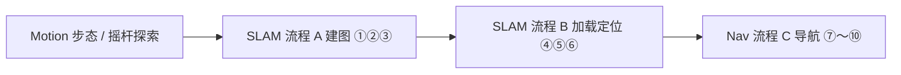

# nav_viz.py — MagicDog 导航可视化 GUI

基于 **MagicDog Python SDK** 的桌面工具，通过 **gRPC（GrpcOnly）** 连接机载 `eame_app`，在 WiFi / 机器人 AP 网络下完成：

- 高层运动（步态、特技、虚拟摇杆 20Hz）
- SLAM 建图与地图管理
- 栅格地图导航（初始位姿、目标点、任务控制）
- 语音 / TTS（Audio，gRPC）
- LCD 表情（Display，gRPC）
- RTSP 相机预览（可选，不经过 SDK）

---

## 目录

- [环境要求](#环境要求)
- [快速开始](#快速开始)
- [界面概览](#界面概览)
- [推荐使用流程](#推荐使用流程)
- [连接时 SDK 初始化](#连接时-sdk-初始化)
- [各页功能与 API 对照](#各页功能与-api-对照)
- [操作反馈与日志](#操作反馈与日志)
- [命令行参数](#命令行参数)
- [常见问题](#常见问题)
- [相关文件](#相关文件)

---

## 环境要求

| 项目 | 说明 |
|------|------|
| Python | 3.8+ |
| 系统包 | `python3-tk`（Tkinter） |
| Python 依赖 | 见 `requirements.txt`：`numpy`、`matplotlib`（地图）；`opencv-python`、`Pillow`（Video 页 RTSP，可选） |
| SDK | 已编译 `magicdog_python`，产物在 `magicdog_sdk/build/` |
| 网络 | PC 与机器人在同一网段；默认机器人 gRPC `192.168.55.200:50051`，PC 示例 `192.168.55.10` |
| 中文字体（推荐） | `fonts-noto-cjk` 或 `fonts-wqy-microhei`，避免界面与地图中文为方框 |
| Linux RTSP | 系统安装 FFmpeg（OpenCV 拉流），例如 `sudo apt install ffmpeg` |

```bash
# Ubuntu 示例
sudo apt install python3-tk fonts-noto-cjk ffmpeg
pip install -r requirements.txt
```

未安装 OpenCV / Pillow 时仍可启动 GUI，**Video** 页会提示安装依赖，其余 Tab 正常。

---

## 快速开始

```bash
# 1. 编译 SDK（在 magicdog_sdk 根目录）
mkdir -p build && cd build
cmake .. && make -j

# 2. 运行 GUI
cd ../example/python_viz
export PYTHONPATH=/path/to/magicdog_sdk/build:$PYTHONPATH
python3 nav_viz.py --local-ip 192.168.55.10 --robot-ip 192.168.55.200
```

1. 在 **Connection** 栏确认 **Local IP** / **Robot gRPC**，点击 **Connect**。
2. 建图或导航前，在 **Motion** 将步态设为 **Down climb stairs (nav)**。
3. 按下方 [推荐使用流程](#推荐使用流程) 在 **SLAM** → **Nav** 页操作。
4. 底部 **Log · 操作反馈** 查看结果；可拖动分隔条调整日志区高度。

---

## 界面概览

主窗口默认约 **1180×820**（最小 960×640），自上而下：

| 区域 | 内容 |
|------|------|
| 标题栏 | 产品名 + 功能摘要（gRPC · Motion · SLAM · Nav · Audio · Video） |
| Connection | Local IP、Robot gRPC、Connect / Disconnect、连接状态 |
| Tab 区 | 五个标签页（可滚动页用右侧滚动条 / 滚轮） |
| Log · 操作反馈 | 可拖动分隔条；全局状态徽章 + 滚动日志（默认约 4 行高） |

| Tab | 作用 |
|-----|------|
| **Motion** | 步态 / 特技 / 虚拟摇杆推流 |
| **SLAM** | 流程 A 建图、流程 B 加载与定位、地图维护 |
| **Nav** | 流程 C 导航、位姿参数、占用栅格地图交互 |
| **Audio** | 音量、TTS、语音配置（gRPC） |
| **Display** | 表情列表、设置 / 查询当前表情（gRPC） |
| **Video** | RTSP 预览 + 摇杆（与 Motion 共用一条推流） |

**摇杆推流**：Motion 与 Video 各有一套摇杆 UI，但同一时刻只有一路 20Hz `send_joystick_command`；在某一页点击 **Start stream** 后，读数来自该页摇杆，另一页摇杆会同步显示状态（推流中 / 已停止）。

---

## 推荐使用流程

建图 / 导航前，在 **Motion** 将步态设为 **Down climb stairs (nav)**（`GaitMode.GAIT_DOWN_CLIMB_STAIRS`）。



| 阶段 | 页面 | 要点 |
|------|------|------|
| 探索 / 步态 | Motion | `Set gait` → 建图用摇杆巡逻需 **Start stream** |
| 新环境建图 | SLAM · 流程 A | ① 开始建图 → ② Motion 探索 → ③ 保存地图 |
| 已有地图 | SLAM · 流程 B | ④ 刷新列表 → ⑤ 加载 → ⑥ 切换定位 |
| 导航 | Nav · 流程 C | ⑦ 刷新地图 → ⑧ Nav mode ON → ⑨ 初始位姿 → ⑩ 目标与导航 |

流程 B 完成后在 **Nav** 页继续；不必再回到旧称 “Navigation & Map” 标签。

---

## 连接时 SDK 初始化

点击 **Connect** 后，`RobotSession` 内部顺序：

| 步骤 | Python API | 说明 |
|------|------------|------|
| 1 | `MagicRobot()` | 创建实例 |
| 2 | `initialize_grpc_only(local_ip, HIGH_LEVEL_MOTION \| SLAM_NAVIGATION, robot_ip)` | GrpcOnly，仅高层运动 + SLAM/导航 |
| 3 | `connect()` | gRPC 连接 `eame_app` |
| 4 | `set_motion_control_level(ControllerLevel.HIGH_LEVEL)` | 高层控制 |
| 5 | `get_high_level_motion_controller()` / `get_slam_nav_controller()` | 运动与 SLAM 控制器 |
| 6 | `high.enable_joy_stick()` | 允许摇杆指令 |
| 7 | `get_audio_controller()` | Audio 页 gRPC（音量 / TTS / 配置） |
| 后台 | `get_current_localization_info()` / `get_nav_task_status()` | 约 0.5s 轮询，更新 Nav 状态与地图机器人位姿 |

**Disconnect**：停止摇杆线程 → `disable_joy_stick()` → 关闭 Audio 订阅与 `audio.shutdown()` → `disconnect()` → `shutdown()`。

与完整 `robot.initialize()` 的区别：不启 LCM 传感器/低层运动；GrpcOnly 下里程计订阅不可用（与 SDK 一致）。**Video** 使用 OpenCV 直连 RTSP，不经过 SDK。

---

## 各页功能与 API 对照

### Connection

| GUI | Python API | C++ 对应 |
|-----|------------|----------|
| Connect | 见上表 | `Initialize` / `Connect` 等 |
| Disconnect | `disconnect()`、`shutdown()` | `Disconnect` / `Shutdown` |

---

### Motion

| GUI | Python API | C++ `HighLevelMotionController` |
|-----|------------|----------------------------------|
| Set gait | `high.set_gait(GaitMode)` | `SetGait` |
| Get gait | `high.get_gait()` → `(Status, GaitMode)` | `GetGait` |
| 当前步态（状态行） | Connect / Get / Set 后刷新；见下方说明 | — |
| Execute | `high.execute_trick(TrickAction)` | `ExecuteTrick` |
| Start stream | 20Hz `high.send_joystick_command(JoystickCommand)` | `SendJoyStickCommand` |
| Stop | 停止线程，摇杆回中发零 | — |

**Get gait 与界面显示（GrpcOnly）**

- SDK 侧 `GetGait` 常读 gRPC 状态流缓存，未同步时可能返回 **`id=9999`（GAIT_NONE）** 或 `-1`，与机器人实际步态不一致。
- GUI 将 `9999` / `-1` 视为无效；**Set gait 成功**后以所设步态更新界面，并记住「上次 Set」。
- **Get gait** 若仍为无效值，状态行显示参考步态（默认 `GAIT_STAND_R` 或上次 Set），Log 中会注明 `not synced`。
- 下拉框内步态与 `magic_type.h` 中 `GaitMode` 对应；特技列表见 `TrickAction`。

**摇杆轴**（`JoystickCommand`）：

| 摇杆 | 字段 | 含义 |
|------|------|------|
| 左 | `left_x_axis`, `left_y_axis` | 横向、前进（Y 向上为正） |
| 右 | `right_x_axis` | 偏航 / 转向（Video 页右摇杆仅水平） |

---

### SLAM

| 步骤 | GUI | Python API | C++ `SlamNavController` |
|------|-----|------------|-------------------------|
| ① | 开始 / 取消建图 | `start_mapping()` / `cancel_mapping()` | `StartMapping` / `CancelMapping` |
| ③ | 保存地图 | `save_map(name)` | `SaveMap` |
| ④ | 刷新列表 | `get_all_map_info()` | `GetAllMapInfo` |
| ⑤ | 加载选中 | `load_map(name)` | `LoadMap` |
| ⑥ | 切换定位 | `switch_to_location()` | `SwitchToLocation` |
| — | 删除选中 | `delete_map(name)` | `DeleteMap` |
| — | 关闭 SLAM（Idle） | `switch_to_idle()` | `SwitchToIdle` |

页面内容较多，使用**垂直滚动**查看流程 B 与底部「维护」区。

---

### Nav（地图导航）

| 步骤 | GUI | Python API | 说明 |
|------|-----|------------|------|
| ⑦ | 刷新地图 | `get_all_map_info()` | 刷新右侧占用栅格 |
| ⑧ | Nav mode ON | `activate_nav_mode(NavMode.GRID_MAP)` | 开启栅格导航 |
| ⑨ | 提交 Init pose | `init_pose(Pose3DEuler)` | position [X,Y,0] + orientation [Roll,Pitch,Yaw]（rad） |
| ⑨ | 填入定位位姿 | — | 从 `get_current_localization_info()` 写入「初始位姿」行 |
| ⑩ | 导航到目标点 | 见下「发起导航」 | `set_nav_target` |
| ⑩ | 暂停 / 继续 / 取消 | `pause_nav_task()` / `resume_nav_task()` / `cancel_nav_task()` | |
| — | 查询导航状态 | `get_nav_task_status()` | 更新 Nav 状态文案 |

**发起导航**（工具栏 / 左键双击，模式为「导航目标」）：

1. `set_gait(GAIT_DOWN_CLIMB_STAIRS)`
2. `disable_joy_stick()`
3. 构造 `NavTarget`（`frame_id="map"`，目标来自「导航目标」行 X/Y/Yaw）
4. `set_nav_target(tgt)`
5. `enable_joy_stick()`

**地图鼠标**（需先选「地图点击」模式）：

| 操作 | 导航目标模式 | 初始位姿模式 |
|------|----------------|----------------|
| 左键单击 | 设置目标 X/Y | 设置初始 X/Y |
| 右键按住拖动 | 以当前 X/Y 为圆心设 Yaw（箭头预览） | 同左 |
| 左键双击 | `set_nav_target` | `init_pose` |

**位姿参数**（左栏「位姿参数」）：

- **初始位姿**：X、Y、Yaw、Roll、Pitch（弧度）
- **导航目标**：X、Y、Yaw；可用「目标 Yaw ← 定位」从定位结果拷贝偏航

**图例**：绿箭头 = 当前定位；黄箭头 = 初始位姿预览；红叉 + 短箭头 = 导航目标。

---

### Audio

对应 `AudioController`（`sdk/include/magic_audio.h`）的 **gRPC** 接口；交互可参考 `example/python/audio_example.py`（本 GUI 不含 LCM 语音流 / Speech IO）。

| 区域 | GUI | Python API |
|------|-----|------------|
| 音量 | 滑块 0–100，Get / Set | `get_volume()` / `set_volume()` |
| TTS | ID、Priority、Mode、文本，Play / Stop | `play(TtsCommand)` / `stop()` |
| 语音配置 | Get config、Switch 模型 | `get_voice_config()` / `switch_tts_voice_model()` |

- Connect 后获取 `get_audio_controller()`，无需 `audio.initialize()`（不启 LCM）。

---

### Display（LCD 表情）

对应 `DisplayController`（`sdk/include/magic_display.h`），参考 `example/python/display_example.py`。

| GUI | Python API | gRPC |
|-----|------------|------|
| Refresh list | `get_all_face_expressions()` | `getAllFaceExpressions` |
| Get current | `get_current_face_expression()` | `getFaceExpression` |
| Set face | `set_face_expression(id)` | `setFaceExpression` |

Connect 后 `get_display_controller()` 即可，无需 LCM。

---

### Video（RTSP）

不经过 MagicDog SDK；**OpenCV + Pillow** 解码，`ImageTk` 显示。

| GUI | 说明 |
|-----|------|
| URL | 默认 `rtsp://<机器人IP>:<rtsp-port>`，默认端口 **8082** |
| 同步机器人 IP | 从 Connection 的 Robot 主机名重写 URL |
| Start / Stop | 后台线程 `VideoCapture` 读帧 |
| 统计栏 | 近 1s 接收 FPS、OpenCV 流 FPS 标注、帧数、读失败次数、源/显示分辨率、播放时长 |
| 摇杆 | 与 Motion 共用推流；适合边看画面边控狗 |

- 切换 Tab、Disconnect 或关闭窗口会自动 Stop RTSP。
- 若相机路径非根路径，请写全 URL，例如 `rtsp://192.168.55.200:8082/stream`。

---

## 操作反馈与日志

Tab 区与 **Log · 操作反馈** 之间有**可拖动分隔条**（默认日志区约 **140px** 高，约 4 行文本）。

| 徽章 | 含义 |
|------|------|
| `IDLE` 灰 | 等待操作 |
| `···` 黄 | 已点击，执行中 |
| `OK` 绿 | 成功 |
| `FAIL` 红 | 失败 |

说明文案显示在徽章右侧，并同步写入 Log；约 **10 秒**后恢复 idle。Connect、各 Tab 主要按钮、SLAM 流程步骤、地图工具栏等均接入反馈。

---

## 命令行参数

```bash
python3 nav_viz.py --help
```

| 参数 | 默认值 | 说明 |
|------|--------|------|
| `--local-ip` | `192.168.55.10` | 本机在与机器人同一局域网内的 IP |
| `--robot-ip` | `192.168.55.200` | `eame_app` gRPC 主机名或 IP |
| `--rtsp-port` | `8082` | Video 页默认 RTSP 端口（与 IP 组成 `rtsp://IP:PORT`） |

---

## 常见问题

| 现象 | 处理 |
|------|------|
| `Cannot import magicdog_python` | 编译 SDK，`export PYTHONPATH=.../build:$PYTHONPATH` |
| 中文方框 / Matplotlib 缺字 | 安装 `fonts-noto-cjk`；查看启动日志中的 UI / Matplotlib 字体 |
| 地图空白 | SLAM 页 **加载选中** 后，Nav 页点 **刷新地图** |
| 导航失败 | 完成 SLAM ⑥ 定位、Nav ⑧ 开导航、⑨ 初始位姿；步态为 `GAIT_DOWN_CLIMB_STAIRS` |
| Get gait 显示 9999 / 与真机不一致 | GrpcOnly 缓存未同步属正常；以 **Set gait** 为准，或看 Log 中的 `not synced` 说明 |
| RTSP 黑屏 / 无法连接 | 核对 URL、端口与路径；安装 `opencv-python`、`ffmpeg`；看 Log 中 `RTSP:` 行 |
| Video 页缺失 | 未装 OpenCV/Pillow：`pip install opencv-python Pillow` |
| 摇杆无响应 | 需 **Connect** 且 **Start stream**；导航发目标时会短暂 `disable_joy_stick` |
| Log 区太小 | 向上拖动 Tab 与 Log 之间的分隔条 |

---

## 相关文件

| 路径 | 说明 |
|------|------|
| `nav_viz.py` | GUI 主程序 |
| `requirements.txt` | Python 第三方依赖 |
| `../python/slam_example.py` | 键盘版 SLAM / 导航示例 |
| `../python/navigation_example.py` | 导航示例 |
| `../python/audio_example.py` | Audio API 示例 |
| `sdk/include/magic_motion.h` | 高层运动 API |
| `sdk/include/magic_slam_navigation.h` | SLAM / 导航 API |
| `sdk/include/magic_audio.h` | 语音 / TTS API |
| `sdk/include/magic_type.h` | `GaitMode`、`TrickAction`、`NavTarget`、`Pose3DEuler` 等 |
